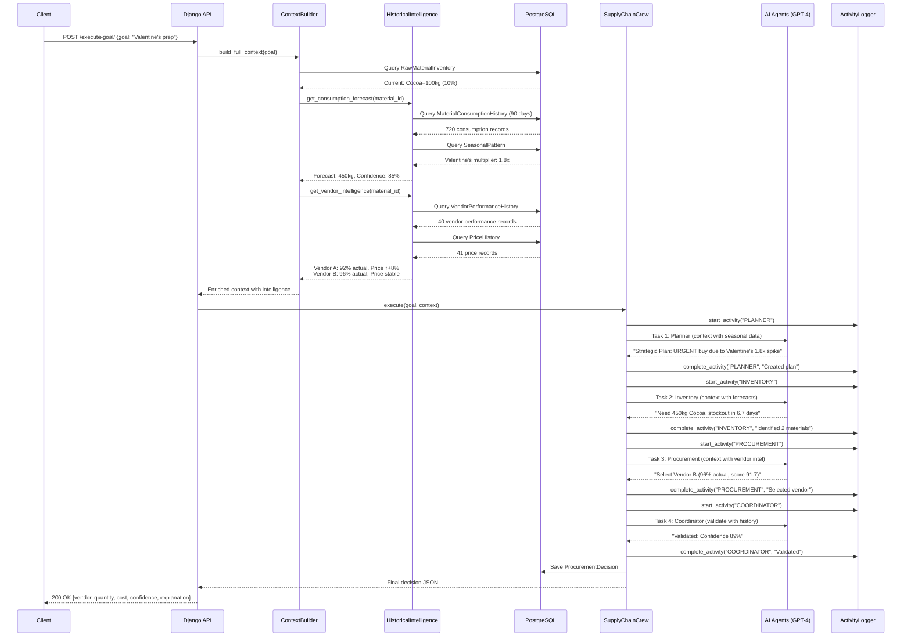

# ChocoCraft Supply Chain AI - System Architecture

## High-Level Architecture Diagram

```
┌─────────────────────────────────────────────────────────────────────────────────┐
│                           EXTERNAL CLIENTS                                      │
│  ┌─────────────┐  ┌──────────────┐  ┌─────────────┐  ┌──────────────────┐    │
│  │   Web UI    │  │  Mobile App  │  │   API       │  │  Django Admin    │    │
│  │  (React)    │  │              │  │   Client    │  │  Interface       │    │
│  └──────┬──────┘  └──────┬───────┘  └──────┬──────┘  └────────┬─────────┘    │
└─────────┼─────────────────┼──────────────────┼──────────────────┼──────────────┘
          │                 │                  │                  │
          │                 └──────────────────┴──────────────────┘
          │                                    │
          │                          ┌─────────▼──────────┐
          │                          │   NGINX/HTTPS      │
          │                          │   Reverse Proxy    │
          │                          └─────────┬──────────┘
          │                                    │
┌─────────▼────────────────────────────────────▼──────────────────────────────────┐
│                              DJANGO REST API (Port 8000)                        │
│  ┌──────────────────────────────────────────────────────────────────────────┐  │
│  │                          API ENDPOINTS LAYER                             │  │
│  │  ┌──────────────────┐  ┌───────────────────┐  ┌────────────────────┐   │  │
│  │  │ /execute-goal/   │  │ /system-status/   │  │ /agent-pulse/      │   │  │
│  │  │ (POST)           │  │ (GET)             │  │ (GET)              │   │  │
│  │  └────────┬─────────┘  └─────────┬─────────┘  └─────────┬──────────┘   │  │
│  │           │                      │                       │              │  │
│  │           │    ┌─────────────────┴───────────────────────┤              │  │
│  │           │    │  /agent-summary/, /execution-trace/     │              │  │
│  └───────────┼────┴──────────────────────────────────────────┼──────────────┘  │
│              │                                                │                 │
│  ┌───────────▼────────────────────────────────────────────────▼──────────────┐ │
│  │                         VIEWS LAYER                                       │ │
│  │  ┌──────────────────┐                  ┌──────────────────────────────┐  │ │
│  │  │  main_views.py   │                  │  agent_activity_views.py     │  │ │
│  │  │  - execute_goal  │                  │  - live_agent_pulse          │  │ │
│  │  │  - health_check  │                  │  - agent_summary             │  │ │
│  │  │  - system_status │                  │  - execution_trace           │  │ │
│  │  └────────┬─────────┘                  └──────────────┬───────────────┘  │ │
│  └───────────┼────────────────────────────────────────────┼──────────────────┘ │
│              │                                            │                    │
│  ┌───────────▼────────────────────────────────────────────▼──────────────────┐ │
│  │                        ORCHESTRATION LAYER                                │ │
│  │  ┌─────────────────────────────────────────────────────────────────────┐ │ │
│  │  │                    SupplyChainCrew (crew.py)                        │ │ │
│  │  │  ┌───────────────────────────────────────────────────────────────┐ │ │ │
│  │  │  │  Workflow: Sequential Process (Process.sequential)            │ │ │ │
│  │  │  │  1. Planner → 2. Inventory → 3. Procurement → 4. Coordinator  │ │ │ │
│  │  │  └───────────────────────────────────────────────────────────────┘ │ │ │
│  │  │                                                                     │ │ │
│  │  │  ┌────────────┐  ┌────────────┐  ┌────────────┐  ┌────────────┐  │ │ │
│  │  │  │  Strategic │  │ Inventory  │  │Procurement │  │ Coordinator│  │ │ │
│  │  │  │   Planner  │→ │  Monitor   │→ │ Specialist │→ │ Validator  │  │ │ │
│  │  │  │  (GPT-4)   │  │  (GPT-4)   │  │  (GPT-4)   │  │  (GPT-4)   │  │ │ │
│  │  │  │  Temp: 0.5 │  │  Temp: 0.2 │  │  Temp: 0.4 │  │  Temp: 0.3 │  │ │ │
│  │  │  └────────────┘  └────────────┘  └────────────┘  └────────────┘  │ │ │
│  │  │        │               │               │               │          │ │ │
│  │  │        └───────────────┴───────────────┴───────────────┘          │ │ │
│  │  │                            │                                      │ │ │
│  │  │                  ┌─────────▼──────────┐                          │ │ │
│  │  │                  │ AgentActivityLogger│                          │ │ │
│  │  │                  │ (Live Tracking)    │                          │ │ │
│  │  │                  └────────────────────┘                          │ │ │
│  │  └─────────────────────────────────────────────────────────────────┘ │ │
│  └─────────────────────────────────────────────────────────────────────┘ │
│                                                                             │
│  ┌───────────────────────────────────────────────────────────────────────┐ │
│  │                        SERVICES LAYER                                 │ │
│  │  ┌───────────────────┐  ┌────────────────────┐  ┌─────────────────┐ │ │
│  │  │ ContextBuilder    │  │HistoricalIntellige │  │  DataFetcher    │ │ │
│  │  │ (context_builder) │  │   nce Service      │  │ (data_fetcher)  │ │ │
│  │  │                   │  │                    │  │                 │ │ │
│  │  │• build_full_      │  │• get_consumption_  │  │• get_all_       │ │ │
│  │  │  context()        │  │  forecast()        │  │  inventory()    │ │ │
│  │  │• enrich_materials │  │• get_vendor_       │  │• get_vendors_   │ │ │
│  │  │  _with_intel()    │  │  intelligence()    │  │  for_material() │ │ │
│  │  │• enrich_vendors_  │  │• get_price_trend_  │  │• save_decision()│ │ │
│  │  │  with_intel()     │  │  analysis()        │  │                 │ │ │
│  │  │                   │  │• get_ai_learning_  │  │                 │ │ │
│  │  │                   │  │  insights()        │  │                 │ │ │
│  │  └─────────┬─────────┘  └──────────┬─────────┘  └────────┬────────┘ │ │
│  │            │                       │                      │          │ │
│  │  ┌─────────▼───────────────────────▼──────────────────────▼────────┐ │ │
│  │  │          DecisionMemory         │     CacheUtils                │ │ │
│  │  │          (decision_memory)      │     (cache_utils)             │ │ │
│  │  │                                 │                               │ │ │
│  │  │  • save_decision()              │  • Redis caching layer        │ │ │
│  │  │  • get_recent_decisions()       │  • TTL: 300s (5 min)         │ │ │
│  │  │  • get_learning_insights()      │  • Reduces DB queries        │ │ │
│  │  └─────────────────────────────────┴───────────────────────────────┘ │ │
│  └───────────────────────────────────────────────────────────────────────┘ │
│                                                                             │
│  ┌───────────────────────────────────────────────────────────────────────┐ │
│  │                        DATA MODELS LAYER (Django ORM)                 │ │
│  │  ┌─────────────────────────────────────────────────────────────────┐ │ │
│  │  │  OPERATIONAL MODELS (6)          │  INTELLIGENCE MODELS (5)     │ │ │
│  │  │  ┌──────────────────────┐        │  ┌─────────────────────────┐│ │ │
│  │  │  │ • User               │        │  │• MaterialConsumption    ││ │ │
│  │  │  │ • Company            │        │  │  History (720 records)  ││ │ │
│  │  │  │ • RawMaterialInventory│       │  │• VendorPerformance      ││ │ │
│  │  │  │ • Vendor             │        │  │  History (40 records)   ││ │ │
│  │  │  │ • CustomerOrder      │        │  │• SeasonalPattern        ││ │ │
│  │  │  │ • ProcurementDecision│        │  │  (20 records)           ││ │ │
│  │  │  └──────────────────────┘        │  │• PriceHistory           ││ │ │
│  │  │                                  │  │  (41 records)           ││ │ │
│  │  │  TRACKING MODELS (3)             │  │• AIDecisionFeedback     ││ │ │
│  │  │  ┌──────────────────────┐        │  │  (45 records)           ││ │ │
│  │  │  │ • AgentActivity      │        │  └─────────────────────────┘│ │ │
│  │  │  │   (Live Agent Pulse) │        │  Total: 821 historical      │ │ │
│  │  │  │ • AIDecisionFeedback │        │  intelligence records       │ │ │
│  │  │  │ • MaterialConsumption│        │                             │ │ │
│  │  │  │   History            │        │                             │ │ │
│  │  │  └──────────────────────┘        │                             │ │ │
│  │  └─────────────────────────────────────────────────────────────────┘ │ │
│  └───────────────────────────────────────────────────────────────────────┘ │
└─────────────────────────────────────┬───────────────────────────────────────┘
                                      │
┌─────────────────────────────────────▼───────────────────────────────────────┐
│                          DATABASE LAYER                                     │
│  ┌───────────────────────────────────────────────────────────────────────┐ │
│  │                      PostgreSQL Database                              │ │
│  │  ┌─────────────────┐  ┌─────────────────┐  ┌────────────────────┐   │ │
│  │  │ supply_chain_*  │  │ Historical Data │  │  Agent Activities  │   │ │
│  │  │ (14 tables)     │  │ (5 tables)      │  │  (1 table)         │   │ │
│  │  │                 │  │ 821 records     │  │  Real-time tracking│   │ │
│  │  └─────────────────┘  └─────────────────┘  └────────────────────┘   │ │
│  │                                                                       │ │
│  │  Indexes: agent_type, started_at, execution_id, material_id          │ │
│  └───────────────────────────────────────────────────────────────────────┘ │
│                                                                             │
│  ┌───────────────────────────────────────────────────────────────────────┐ │
│  │                      Redis Cache Layer                                │ │
│  │  • Key Pattern: supply_chain:*                                        │ │
│  │  • TTL: 300 seconds (5 minutes)                                       │ │
│  │  • Cached: Inventory data, vendor lists, historical forecasts        │ │
│  └───────────────────────────────────────────────────────────────────────┘ │
└─────────────────────────────────────────────────────────────────────────────┘

┌─────────────────────────────────────────────────────────────────────────────┐
│                          EXTERNAL SERVICES                                  │
│  ┌────────────────────────────────────────────────────────────────────┐    │
│  │                     OpenAI API (GPT-4)                             │    │
│  │  • Model: gpt-4 (or configured model)                             │    │
│  │  • Used by: All 4 agents (Planner, Inventory, Procurement, Coord) │    │
│  │  • Temperature: 0.2-0.5 (optimized for business decisions)        │    │
│  │  • Context: Historical data + task descriptions                   │    │
│  └────────────────────────────────────────────────────────────────────┘    │
└─────────────────────────────────────────────────────────────────────────────┘
```

## Detailed Data Flow: Historical Intelligence Integration



## Agent Intelligence Matrix

| Agent | Temperature | Historical Data Sources | Primary Function | Decision Style |
|-------|-------------|------------------------|------------------|----------------|
| **Strategic Planner** | 0.5 | • SeasonalPattern<br>• MaterialConsumptionHistory<br>• Business goals | Interprets goal with seasonal awareness, creates strategic procurement plan | Creative strategic thinking |
| **Inventory Monitor** | 0.2 | • MaterialConsumptionHistory (90 days)<br>• SeasonalPattern<br>• Lead times | Forecasts 30-60 day demand, identifies stockout risks, calculates reorder points | Precise with flexibility |
| **Procurement Specialist** | 0.4 | • VendorPerformanceHistory (40 orders)<br>• PriceHistory (41 records)<br>• Quality scores | Applies 40-30-30 weighted scoring, selects optimal vendor balancing price/speed/reliability | Balanced judgment |
| **Coordinator** | 0.3 | • AIDecisionFeedback (45 decisions)<br>• All historical patterns<br>• Validation rules | Validates decisions against historical outcomes, adjusts confidence scores | Consistent validation |

**Total Historical Records Used:** 821 intelligence records power all agent decisions

## Technology Stack

```yaml
Backend:
  Language: Python 3.11
  Framework: Django 4.2.7
  API: Django REST Framework 3.14.0
  AI Framework: CrewAI 0.51.0
  LLM Integration: langchain-openai 0.1.17
  
AI Models:
  Provider: OpenAI
  Model: GPT-4 (configurable)
  Temperature Range: 0.2 - 0.5
  Context Window: Up to 8,192 tokens
  
Database:
  Primary: PostgreSQL 13+
  Cache: Redis 5.0.1
  ORM: Django ORM
  Migration Tool: Django Migrations
  
Deployment:
  App Server: Gunicorn (production) / Django dev server (development)
  Reverse Proxy: Nginx (recommended)
  Process Manager: Supervisor / systemd
  Containerization: Docker (optional)
  
Development Tools:
  Testing: pytest, Django TestCase
  Linting: flake8, black
  Type Checking: mypy
  API Documentation: drf-spectacular (OpenAPI 3.0)
```

## Key Design Patterns

### 1. Service Layer Pattern
```
Views → Services → Models
• Views are thin controllers (validation + HTTP)
• Services contain business logic
• Models are data layer only
• Easy to test and maintain
```

### 2. Intelligent Context Enrichment
```
Raw Data + Historical Intelligence = Enriched Context

Example:
Raw: "Cocoa: 100kg (10% stock)"
↓
Enriched: "Cocoa: 100kg (10%)
          Forecast: 450kg needed (1.8x Valentine's)
          Vendor A: 92% actual on-time (15 orders)
          Vendor B: 96% actual on-time (10 orders)
          Price trend: INCREASING +8.3%"
```

### 3. Sequential Agent Workflow
```
Planner (Strategic) 
  → Inventory (Forecasting)
    → Procurement (Vendor Selection)
      → Coordinator (Validation)
        → Final Decision
```

### 4. Activity Tracking Pattern
```
Each agent action logged to AgentActivity table:
• start_activity() - When agent begins
• update_activity() - During processing
• complete_activity() - When finished
• Links via execution_id for tracing
```

### 5. Cache-Aside Pattern
```python
def get_inventory():
    cache_key = "inventory:all"
    data = cache.get(cache_key)
    if not data:
        data = RawMaterialInventory.objects.all()
        cache.set(cache_key, data, timeout=300)
    return data
```

## API Endpoints

### Core Endpoints

| Method | Path | Description | Auth Required |
|--------|------|-------------|---------------|
| POST | `/api/supply-chain/execute-goal/` | Execute AI workflow | ✅ |
| GET | `/api/supply-chain/health-check/` | System health | ❌ |
| GET | `/api/supply-chain/system-status/` | Inventory summary | ✅ |

### Live Agent Pulse Endpoints

| Method | Path | Description | Auth Required |
|--------|------|-------------|---------------|
| GET | `/api/supply-chain/agent-pulse/` | Recent agent activities | ✅ |
| GET | `/api/supply-chain/agent-summary/` | Statistics by agent/status | ✅ |
| GET | `/api/supply-chain/agent-history/<type>/` | History for specific agent | ✅ |
| GET | `/api/supply-chain/execution-trace/<id>/` | Complete execution timeline | ✅ |
| POST | `/api/supply-chain/agent-cleanup/` | Remove old activities | ✅ Admin |

### Example Request/Response

**Request:**
```bash
POST /api/supply-chain/execute-goal/
Content-Type: application/json

{
  "goal": "Prepare for Valentine's Day production spike"
}
```

**Response (200 OK):**
```json
{
  "goal": "Prepare for Valentine's Day production spike",
  "inventory_status": {
    "total_items": 8,
    "items_needing_reorder": 2,
    "materials": [...]
  },
  "procurement_required": true,
  "selected_vendor": {
    "vendor_id": 2,
    "vendor_name": "Premium Cocoa Co",
    "price_per_unit": 14.0,
    "lead_time_days": 5,
    "actual_reliability": 96
  },
  "order_quantity": 450,
  "expected_cost": 6300,
  "confidence_score": 89,
  "explanation": "Selected Premium Cocoa Co based on:\n- ACTUAL 96% on-time delivery (best)\n- 450kg forecast for Valentine's 1.8x spike\n- Stable price trend\n- 5-day lead time covers 6.7-day stockout risk\n- 40-30-30 weighted score: 91.7"
}
```

## Database Schema

### Core Tables (14 Total)

**Operational Models (6):**
- `auth_user` - User authentication
- `supply_chain_company` - Company profiles
- `supply_chain_rawmaterialinventory` - Current stock levels
- `supply_chain_vendor` - Vendor directory
- `supply_chain_customerorder` - Customer orders
- `supply_chain_procurementdecision` - AI decisions log

**Historical Intelligence (5):**
- `supply_chain_materialconsumptionhistory` - 720 records, 90 days usage
- `supply_chain_vendorperformancehistory` - 40 records, actual performance
- `supply_chain_seasonalpattern` - 20 records, seasonal multipliers
- `supply_chain_pricehistory` - 41 records, price trends
- `supply_chain_aidecisionfeedback` - 45 records, learning insights

**Activity Tracking (3):**
- `supply_chain_agentactivity` - Real-time agent monitoring
- Indexes: `agent_type`, `started_at`, `execution_id`

### Key Relationships

```
Company (1) ─┬─► RawMaterialInventory (Many)
             ├─► Vendor (Many)
             ├─► CustomerOrder (Many)
             └─► ProcurementDecision (Many)

RawMaterialInventory (1) ──► MaterialConsumptionHistory (Many)
                            └► SeasonalPattern (Many)

Vendor (1) ─┬─► VendorPerformanceHistory (Many)
            ├─► PriceHistory (Many)
            └─► ProcurementDecision (Many)

ProcurementDecision (1) ──► AIDecisionFeedback (1)

AgentActivity (Many) ──► execution_id (Group by workflow)
```

## Performance Characteristics

| Metric | Value | Notes |
|--------|-------|-------|
| **Response Time** | 15-30 seconds | Depends on LLM latency (10-20s) |
| **Throughput** | 10-50 concurrent requests | Limited by OpenAI rate limits |
| **Database Queries** | 15-25 per request | Optimized with prefetch_related() |
| **Cache Hit Rate** | 60-80% | For repeated inventory/vendor checks |
| **Historical Data Size** | 821 records | Grows ~50 records/month |
| **Agent Execution** | Sequential (4 steps) | ~3-7s per agent |

## Security Implementation

```
┌─────────────────────────────────────────────────────────────┐
│ Layer            │ Implementation                           │
├──────────────────┼──────────────────────────────────────────┤
│ Authentication   │ Django session + Token-based (DRF)       │
│ Authorization    │ Role-based (User, Staff, Admin)          │
│ API Keys         │ Environment variables only               │
│ HTTPS            │ Required in production (Nginx SSL)       │
│ CORS             │ Configured for frontend domains          │
│ Rate Limiting    │ DRF throttling: 100 req/hour/user        │
│ Input Validation │ DRF serializers + Django forms           │
│ SQL Injection    │ Django ORM auto-escaping                 │
│ XSS Protection   │ Django template auto-escaping            │
│ CSRF Protection  │ Django middleware enabled                │
└─────────────────────────────────────────────────────────────┘
```

## Scalability Roadmap

### Current Architecture (V1.0)
- ✅ Single Django server
- ✅ PostgreSQL + Redis on same host
- ✅ Sequential agent execution
- ✅ Handles 10-50 concurrent users

### Phase 2: Horizontal Scaling
```
Load Balancer (Nginx/HAProxy)
  ├─► Django App Server 1
  ├─► Django App Server 2
  └─► Django App Server 3
        ↓
  Shared Redis Cluster
        ↓
  PostgreSQL (Primary + Read Replicas)
```

### Phase 3: Async Processing
```
API Request → Celery Task Queue (RabbitMQ/Redis)
  ├─► Worker 1: Agent execution
  ├─► Worker 2: Historical calculations
  └─► Worker 3: Report generation
        ↓
  Result Backend (Redis)
        ↓
  Polling endpoint: /api/execution-status/<task_id>/
```

### Phase 4: Microservices (Future)
- Agent service (CrewAI orchestration)
- Intelligence service (Historical calculations)
- API Gateway (Kong/Traefik)
- Event-driven architecture (Kafka)

## Monitoring & Observability

```yaml
Logging:
  Framework: Python logging
  Levels: DEBUG, INFO, WARNING, ERROR
  Output: stdout + file rotation
  Format: JSON structured logs
  
Metrics:
  Agent Activities: AgentActivity model (Live Agent Pulse)
  API Performance: Response times, status codes
  Database: Query count, slow queries
  Cache: Hit/miss rates
  
Error Tracking:
  Recommended: Sentry
  Features: Stack traces, breadcrumbs, performance monitoring
  
Health Checks:
  Endpoint: /api/supply-chain/health-check/
  Checks: Database connection, Redis connection, OpenAI API
  
APM (Optional):
  Tools: New Relic, DataDog, Elastic APM
  Traces: Request flow through services
```

## Deployment Checklist

### Development
- [ ] `python manage.py runserver 0.0.0.0:8000`
- [ ] DEBUG=True in settings
- [ ] SQLite or local PostgreSQL
- [ ] Local Redis instance

### Staging
- [ ] Gunicorn with 4 workers
- [ ] DEBUG=False
- [ ] PostgreSQL with connection pooling
- [ ] Redis with persistence
- [ ] SSL certificate (Let's Encrypt)
- [ ] Environment variables from .env file

### Production
- [ ] Gunicorn + Supervisor/systemd
- [ ] Nginx reverse proxy with SSL
- [ ] PostgreSQL with backups (daily)
- [ ] Redis cluster (HA)
- [ ] Sentry error tracking
- [ ] Log aggregation (ELK stack)
- [ ] Firewall rules (UFW/iptables)
- [ ] Database connection pooling (PgBouncer)
- [ ] Rate limiting at Nginx level
- [ ] Automated backups to S3/equivalent

---

## Appendix: Historical Intelligence Examples

### Example 1: Consumption Forecasting
```python
# MaterialConsumptionHistory Analysis
Material: Cocoa Powder
Records: 90 days (Nov-Jan)
Daily Average: 15 kg/day
Seasonal Multiplier: 1.8x (Valentine's Feb 14)
Forecast (30 days): 15 × 30 × 1.8 = 810 kg
Safety Stock (1.5× lead time): 15 × 7 × 1.5 = 157.5 kg
Recommended Order: 810 + 157.5 - 100 (current) = 867.5 kg
```

### Example 2: Vendor Intelligence
```python
# VendorPerformanceHistory Analysis
Vendor: Premium Cocoa Co
Total Orders: 15
On-Time Deliveries: 14
Actual On-Time %: 93.3% (vs stated 90%)
Avg Quality Score: 4.6/5.0
Avg Delay When Late: 0.8 days
Customer Satisfaction: 4.5/5.0

Intelligence Score: UPGRADE (actual > stated)
Recommendation: Trust this vendor for critical orders
```

### Example 3: Price Trend Analysis
```python
# PriceHistory Analysis
Vendor: Sweet Suppliers Inc
Material: Sugar
Records: 12 price points (6 months)

Price History:
Jan: $8.00 → Feb: $8.20 → Mar: $8.50 → Apr: $8.80
May: $9.00 → Jun: $9.30

Trend: INCREASING (+16.25% over 6 months)
Monthly Rate: +2.7% average
Volatility: Moderate (consistent increase)

Recommendation: BUY NOW - Prices rising steadily
Timing Benefit: Save ~$0.25/kg by ordering this month
```

---

**Document Version:** 2.0  
**Last Updated:** February 22, 2026  
**System Status:** ✅ Operational with 821 historical intelligence records  
**Active Agents:** 4 (Planner, Inventory, Procurement, Coordinator)
